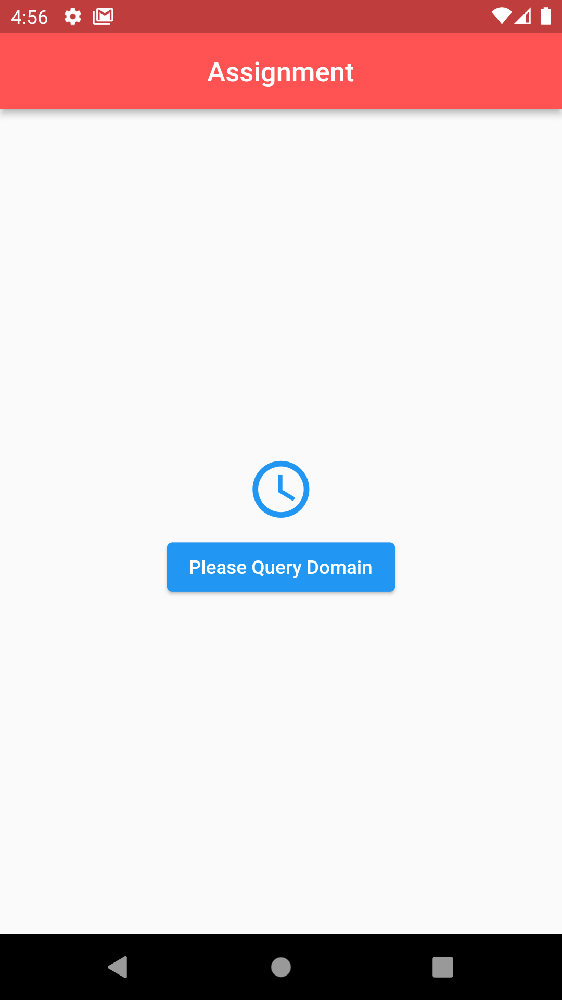

# riseup_mailcheck_task

A Flutter project for email checking, where
    1. search domain for creating an email account
    2. account will be opened with credential
    3. after that send email to created account
    4. finally check mail inbox

